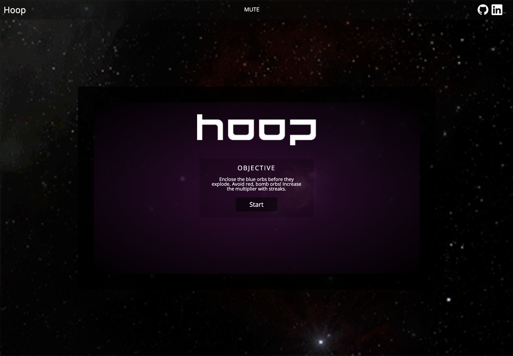
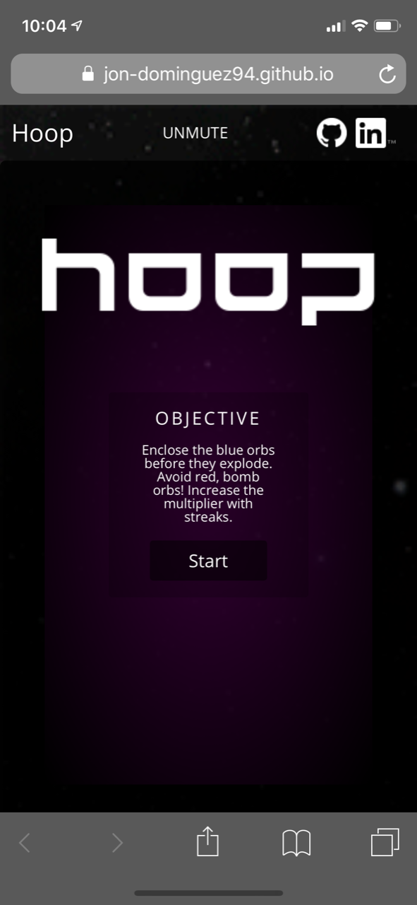
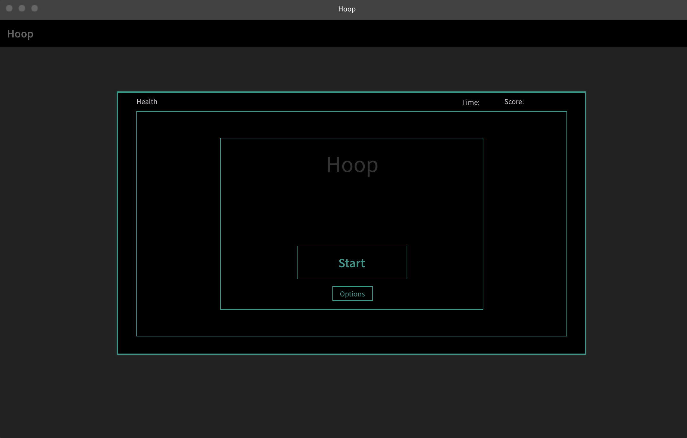
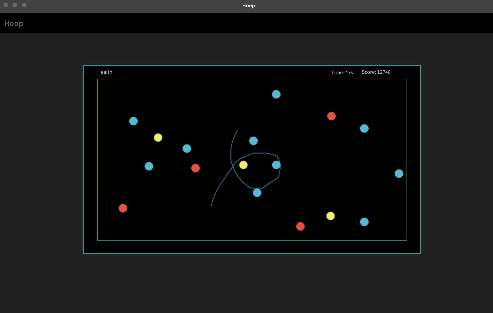
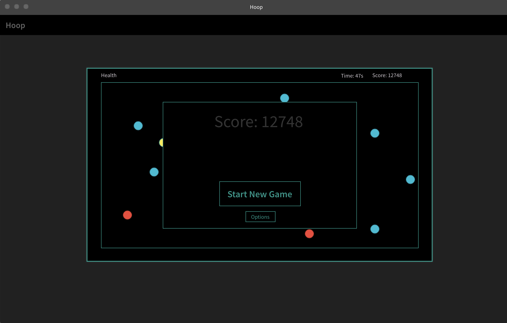
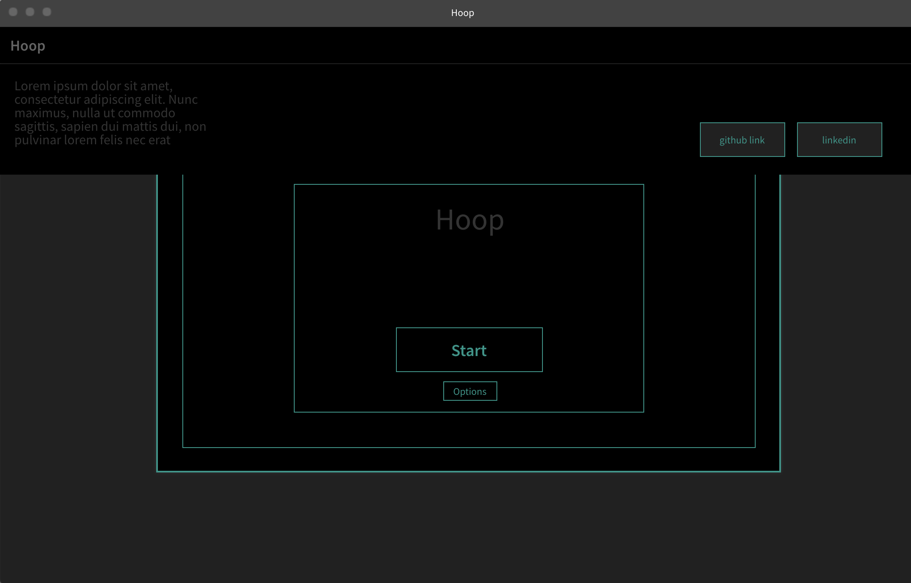

## Background and Overview

Hoop is a simple but addictive game. The main focus of the game is to use your mouse/touchscreen to draw a hoop around blue orbs on the board while avoiding red orbs. Hooping around the blue orb will increase your score, multiplier, and replenish your health. Hooping around red orbs will decrease your health and reset your multiplier.

The longer you survive, the faster objects will show up. Each object has a certain lifetime and will disappear when it expires. Blue will flash before disappearing as an alert so you can give those priority. Allowing blue orbs to die will reset your multiplier and decrease your health.

The traced mouse trail will only last a certain amount of time before fading away. Objects must be fully encompassed with an active trail to count. Hooping around multiple friendlies with the same hoop will result in a bonus.

Play until your health is depleted!

## Demo
Live Link: jon-dominguez94.github.io/hoop

## Technologies

Hoop was built with pure `Javascript` and no external libraries. All game rendering and styling was done with `HTML5 Canvas`

## Site

### Landing Page

Hoop is currently working on all modern browsers, as well as iOS and Android.

  
  

<!--   -->

This app will consist of a single page with a canvas. The canvas contains all the game info including health, score, time, and the board.

Upon loading the page, a modal will be displayed on top of the board with options and a start button. Above the modal will be the name of the game

After pressing start, the modal will disappear and the user can control the mouse to draw on the board. After a few seconds, the game will start

Upon Game Over, the modal will reappear with settings and a restart button. Above this modal will be the score from the previous game

At the top of the page is a dropdown that activated on hover. The dropdown will contain info about the game and links to Github repository and LinkedIn.

## Architecture and Technologies

This project will be implemented with the following technologies

* Vanilla JavaScript for overall structure and game logic
* `HTML5 Canvas` for DOM manipulation and rendering
* Webpack to bundle up and serve the various scripts

## Implementation Timeline

##### Day 1: 
- [ ] Setup all necessary Node Modules, including webpack
- [ ] Setup most of what site will look like including menu modal
- [ ] Learn how to use HTML5 Canvas

##### Day 2: 
- [ ] Write logic for drawing on the canvas
- [ ] Figure out how to only trace past few frames of drawing
- [ ] Figure out how to determine when a hoop is closed and check what is encompassed

##### Day 3:
- [ ] Learn how to draw objects on the board
- [ ] Create random object generator

##### Day 4:
- [ ] Write logic to make objects appear/disappear 
- [ ] Write logic to add/subtract from score

##### Day 5:
- [ ] Add effects
- [ ] Finish styling

##### Day 6:
- [ ] Create about modal
- [ ] Clean up code, styling
- [ ] Publish live site