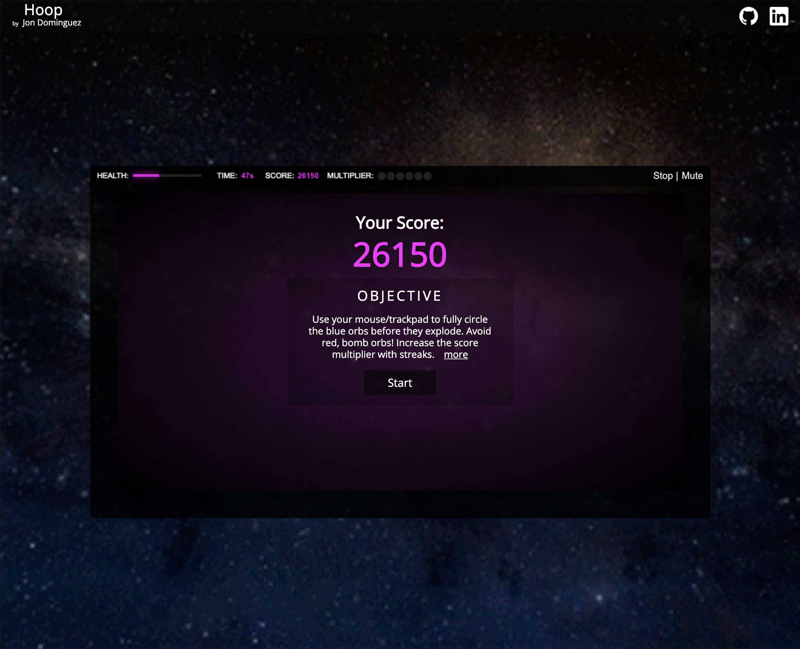
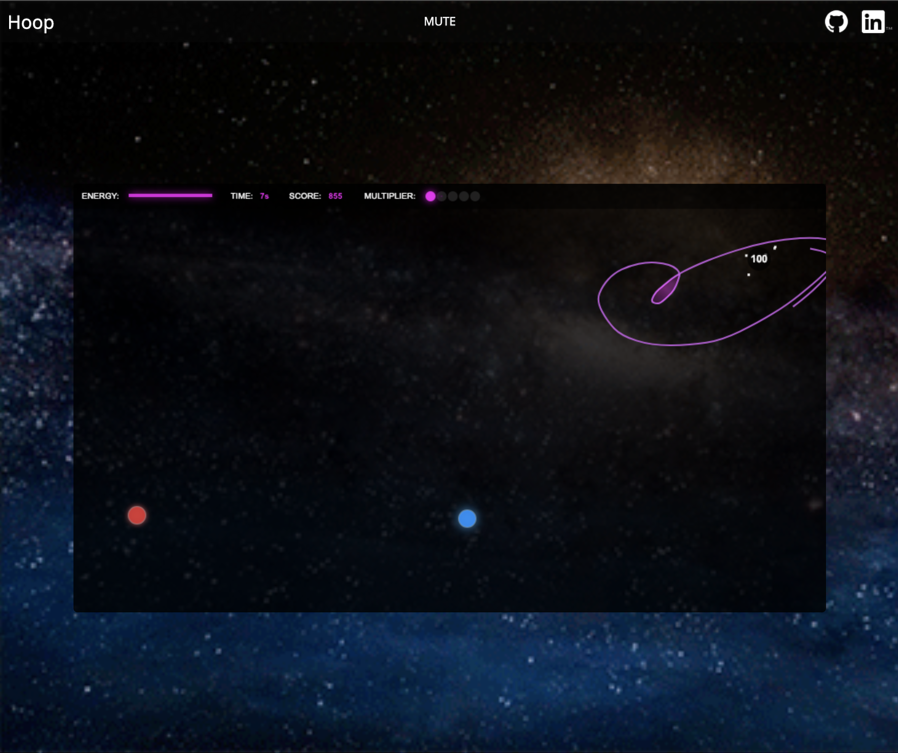

# Table of Contents
- [Background and Overview](#background-and-overview)
  - [Demo](#demo)
- [Technologies](#technologies)
- [Site](#site)
  - [Landing Page](#landing-page)
  - [In-Game](#in-game)
  - [Game Over](#game-over)
- [Feature Highlights](#feature-highlights)
  - [Handle Enclosures](#handle-enclosures)
  - [Particles and Notifications](#particles-and-notifications)
  - [Multiplier](#multiplier)

## Background and Overview

Hoop is a simple but addictive game. The main focus of the game is to use your mouse/touchscreen to draw a hoop around blue orbs on the board while avoiding red orbs. Hooping around the blue orb will increase your score, multiplier, and replenish your health. Hooping around red orbs will decrease your health and reset your multiplier.

The longer you survive, the faster objects will show up. Each object has a certain lifetime and will disappear when it expires. Blue will flash before disappearing as an alert so you can give those priority. Allowing blue orbs to die will reset your multiplier and decrease your health.

The traced mouse trail will only last a certain amount of time before fading away. Objects must be fully encompassed with an active trail to count. Hooping around multiple friendlies with the same hoop will result in a bonus.

Play until your health is depleted!

### Demo
[Live Link](https://jon-dominguez94.github.io/hoop)

## Technologies

Hoop was built with pure `Javascript` and no external libraries. All game rendering and styling was done with `HTML5 Canvas`

## Site

### Landing Page

Hoop is currently working on all modern browsers, as well as iOS and Android. However, mobile versions start in the muted mode.

<div style="display: flex; align-items: center; justify-content: space-between;">
  
  
</div>

### In Game

While playing, fully drawn hoops by the user will highlight with the game theme color. Notifications will show for points, health depletion, and multipliers


### Game Over

Upon game death, the menu will reappear with your score and buttton to start a new game



## Feature Highlights

### Handle Enclosures

There are many things rendering on the board at once so it was difficult to create the game logic. I went through many implementations to figure out when and where orbs were encompassed but I finally landed on the following:

* Render the players trail
  * Array of points connected with quadratic curves
* Check every combination of four points in the trail to see if there are any collisions
  * At least four points to create a closed circle
* Save the start index, end index, and collision point
* Fill that area with a radial-gradient to signify closed circle
* For each active orb, grab each pixel position on the board
  * Each orb is its own canvas on top of the original canvas. Therefore, each orb's position on the window has a matching position on the board
* Check those pixels on the board
  * If it is clear, do nothing. If it has the color of the radial-gradient, orb has been enclosed so react depending on the orb type



```
for(let i = this.enemies.length - 1; i >= 0; i--){
  const enemy = this.enemies[i];
  const ex = Math.round(enemy.x);
  const ey = Math.round(enemy.y);

  const indices = [
    ((ey * bmpw) + Math.round(ex - constants.ENEMY_SIZE)) * 4,
    ((ey * bmpw) + Math.round(ex + constants.ENEMY_SIZE)) * 4,
    ((Math.round(ey - constants.ENEMY_SIZE) * bmpw) + ex) * 4,
    ((Math.round(ey + constants.ENEMY_SIZE) * bmpw) + ex) * 4
  ];
  for(j = indices.length - 1; j >= 0; j++){}
    const index = indices[j];
    if (pixels[index + 1] >= 0 && pixels[index + 2] >= 200) {
      if (enemy.type === constants.ENEMY_TYPE_BOMB || enemy.type === constants.ENEMY_TYPE_BOMB_MOVER) {
        this.handleBombInClosure(enemy);
      }
      else {
        this.handleEnemyInClosure(enemy);

        casualties.push(enemy);
      }

      this.enemies.splice(i, 1);
      break;
    }
  }
}
```

### Particles and Notifications

Whenever something happens in the game, there is a notification. It can vary between adding to the score, losing health, high score increase, and more. Also, when blue orbs are encompassed, an explosion animation is played. At first, it was different to implement because I was rendering everything on one canvas. But in adding this feature, I refactored to have all orbs as their own canvas leading to a much easier implementation of notifications and particles.

* Most notifications inherit the x and y values from object that triggered them
  * This allowed me to render them exactly where the event occurred
* Every framerate, I decrease the notifications y-value to give it an effect of bubbling up

* Particles also inherit x and y values
* However, they are also given a random x and y velocity
* Every framerate, they get updated positions based on their velocities and eventually fade out


```
renderNotifications() {
  for(let i = this.notifications.length - 1; i >= 0; i--){
    const notification = this.notifications[i];

    // Make the text float upwards
    notification.y -= 0.4;

    let radius = 14 * notification.scale;
    this.context.save();
    this.context.font = 'bold ' + Math.round(12 * notification.scale) + "px Arial";

    this.context.beginPath();
    this.context.fillStyle = 'rgba(0,0,0,' + (0.7 * notification.alpha) + ')';
    this.context.arc(notification.x, notification.y, radius, 0, Math.PI * 2, true);
    this.context.fill();

    this.context.fillStyle = "rgba( " + notification.rgb[0] + ", " + notification.rgb[1] + ", " + notification.rgb[2] + ", " + notification.alpha + " )";
    this.context.fillText(notification.text, notification.x - (this.context.measureText(notification.text).width * 0.5), notification.y + (4 * notification.scale));
    this.context.restore();

    // Fade out
    notification.alpha *= 1 - (0.08 * (1 - ((notification.alpha - 0.08) / 1)));

    // If the notifaction is faded out, remove it
    if (notification.alpha < 0.05) {
      this.notifications.splice(i, 1);
    }

    radius += 2;

    this.invalidate(notification.x - radius, notification.y - radius, radius * 2, radius * 2);
  }
}
```

### Multiplier

I wanted the multiplier to gradually step up before increasing to the next level. The logic behind it wasn't difficult but the rendering was a little tricky to come up with but the implementation was simple and clean.

* Render empty black circles for each possible multiplier
* Set fill and shadow styles
* Check if the multiplier has reached a full step
  * If so, fill in the entire circle
  * Else, fill in the circle but adjust the radius by multiplying by the step


```
while (let i = constants.MULTIPLIER_LIMIT - 1; i >= 0; i--) {
  this.context.save();
  this.context.beginPath();

  const x = 6 + (i / constants.MULTIPLIER_LIMIT) * 80;
  const y = 5;
  const radius = 6;

  this.context.fillStyle = 'rgba(40,40,40,0.8)';
  this.context.arc(x, y, radius, 0, Math.PI * 2, true);
  this.context.fill();

  if (i < this.multiplier.major) {
    this.context.beginPath();
    this.context.shadowOffsetX = 0;
    this.context.shadowOffsetY = 0;
    this.context.shadowBlur = 14;
    this.context.shadowColor = "rgba(255,0,255, 0.9)";
    this.context.fillStyle = "rgba(255,0,255, 0.9)";

    // fully filled circle
    if (i < this.multiplier.major - 1) {
      this.context.arc(x, y, radius, 0, Math.PI * 2, true);
    }
    // partially filled
    else {
      this.context.fillStyle = "rgba(255,0,255," + 0.8 * this.multiplier.minor + ")";
      this.context.arc(x, y, radius * this.multiplier.minor, 0, Math.PI * 2, false);
    }
    this.context.fill();
  }
  this.context.restore();
}
```

[Back to Top](#)